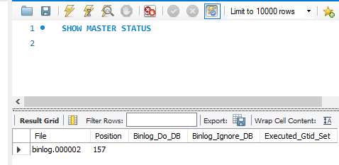
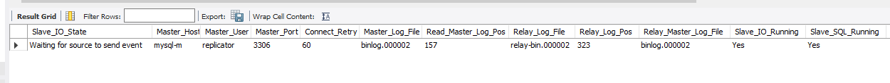
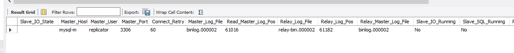
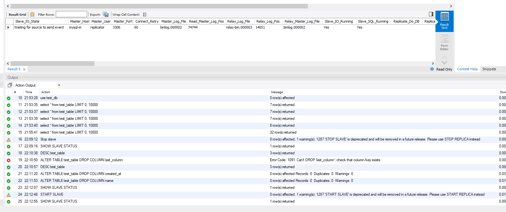
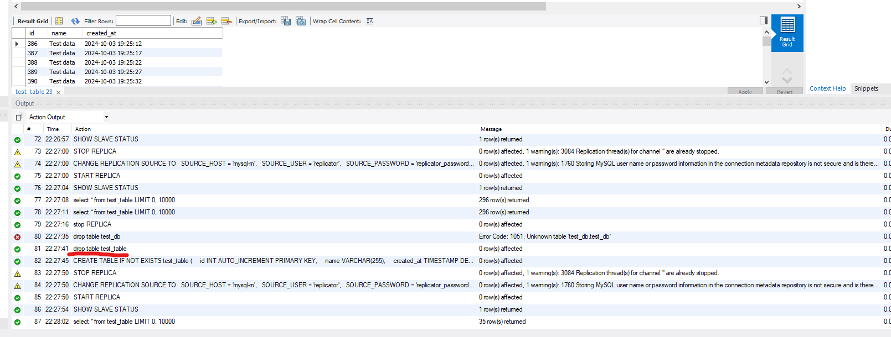

# HSA12 21. Database: Replication

## Set up MySQL Cluster

- Create 3 docker containers: mysql-m, mysql-s1, mysql-s2
- Setup master slave replication (Master: mysql-m, Slave: mysql-s1, mysql-s2)
- Write script that will frequently write data to database.
- Ensure, that replication is working.
- Try to turn off mysql-s1 (stop slave).
- Try to remove a column in database on slave node (try to delete last column and column from the middle).
- Write conclusion in readme.md

## Set Up Master-Slave Replication

### 1. Install Dependencies

````bash
npm install
````

### 2. Run the Project

````bash
docker-compose up --build
````

### 3. Connect to MySQL Master Dashboard (MySQL Workbench for example)

Run the command:

````dbmysql
use test_db
````

Run the command and get params:

````dbmysql
show master status
````



### 4. Connect to MySQL Slave-1, Slave-2 Dashboards (MySQL Workbench for example)

Run the command:

````dbmysql
use test_db
````

Run the command to create a replication with the parameters received from the master status :

````dbmysql
STOP REPLICA;

CHANGE REPLICATION SOURCE TO
  SOURCE_HOST = 'mysql-m',
  SOURCE_USER = 'replicator',
  SOURCE_PASSWORD = 'replicator_password',
  SOURCE_LOG_FILE = 'binlog.000002', // check in result of show master status
  SOURCE_LOG_POS = 157; // check in result of show master status

START REPLICA;
````

Run the command:

````dbmysql
show slave status
````


Slave_IO_Running and Slave_SQL_Running must be Yes.

### 5. Run the Insert Data script

````bash
node ./scripts/insert-data.js
````

You can select data from tables on different instances and get their replication

## Testing

stop 1 slave, drop last column and middle column, start slave, check replication
stop 1 slave, drop column, create column, start slave, check replication

1. Stop one of the slaves:

````dbmysql
STOP REPLICA;
````


Slave_IO_Running and Slave_SQL_Running must be No.

2. Remove the last and middle columns from the table in this slice:

````dbmysql
ALTER TABLE test_table DROP COLUMN created_at;  -- Delete the last column
ALTER TABLE test_table DROP COLUMN name;  -- Remove the middle column
````

3. Start the slave again:

````dbmysql
START REPLICA;
````

4. Check the replication status:

````dbmysql
START REPLICA;
````


If the table structure does not match, replication will not work correctly.

5. Stop the slave & return structure:

````dbmysql
STOP REPLICA;

DROP TABLE test_table;

CREATE TABLE IF NOT EXISTS test_table (
    id INT AUTO_INCREMENT PRIMARY KEY,
    name VARCHAR(255),
    created_at TIMESTAMP DEFAULT CURRENT_TIMESTAMP
  )
````

6. Start the slave again:

````dbmysql
START REPLICA;
````


Replication continues to work

## Conclusion

- Replication Setup: We configured the replication with MASTER_LOG_FILE and MASTER_LOG_POS, and both I/O and SQL threads
  worked correctly. Stopping and restarting the slaves showed that they could catch up with the master once back online.
- Schema Consistency: Dropping columns on the slave (mysql-s1) while replication was stopped caused replication errors
  when the master attempted to send data for missing columns. This highlights the importance of keeping the table
  structure identical on both the master and the slaves.
- Error Recovery: After restoring the dropped columns on the slave, replication resumed without issues. This
  demonstrated that ensuring schema consistency resolves replication failures.
- In summary, MySQL replication is robust but requires careful synchronization of table structures between the master
  and slaves for smooth operation.